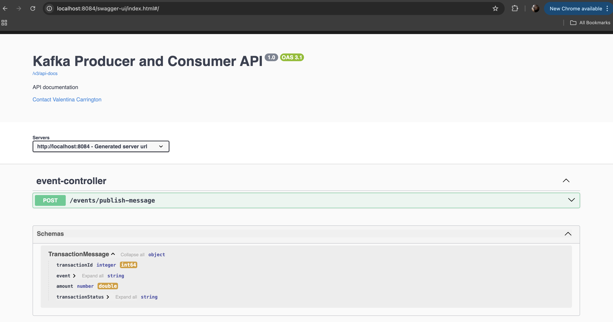

# Kafka Producer and Consumer Example

This project demonstrates how to implement a Kafka producer and consumer using Java and Maven.
We run Zooperkeeper and Kafka using docker compose. 

# Getting Started

### Swagger-UI

Swagger UI provides a web-based interface to visualize and interact with the API's endpoints.
To access Swagger UI:
1. Start the application server.
2. Open a web browser.
3. Navigate to the Swagger UI URL, typically in the format: `http://<server_address>:8084/swagger-ui/index.html`.
4. Use the interface to explore available API endpoints, view request/response schemas, and test API calls.



### POST /events/publish-message

This endpoint sends a message to a Kafka topic.

#### Request Body
- **TransactionMessage**: The message object containing the transaction details to be sent. It includes:
```json
    {
        "transactionId": 1,
        "event": "WITHDRAW",
        "amount": 100.0,
        "transactionStatus": "PENDING"
    }
```


## Testing
### Run all tests
```bash
    ./mvnw test
```

### Run single test
```bash
    ./mvnw -Dtest=<Test_Name> test
```