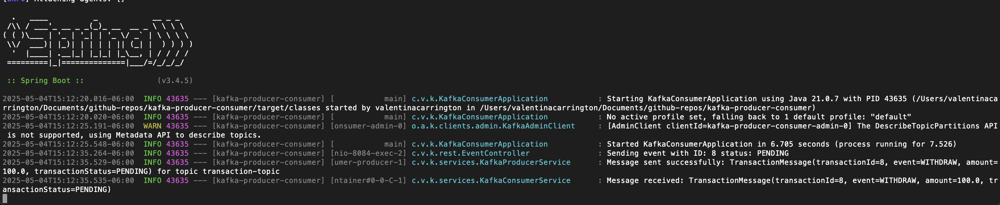

# Kafka Producer and Consumer Example

This project demonstrates how to implement a Kafka producer and consumer using Java and Maven.
We run Zooperkeeper and Kafka using docker compose. 

### POST /events/publish-message

This endpoint sends a message to a Kafka topic.

#### Request Body
- **TransactionMessage**: The message object containing the transaction details to be sent. It includes:
```json
    {
        "transactionId": 1,
        "event": "WITHDRAW",
        "amount": 100.0,
        "transactionStatus": "PENDING"
    }
```



### Reference Documentation
For further reference, please consider the following sections:

* [Official Apache Maven documentation](https://maven.apache.org/guides/index.html)
* [Spring Boot Maven Plugin Reference Guide](https://docs.spring.io/spring-boot/3.4.5/maven-plugin)
* [Create an OCI image](https://docs.spring.io/spring-boot/3.4.5/maven-plugin/build-image.html)
* [Spring for Apache Kafka](https://docs.spring.io/spring-boot/3.4.5/reference/messaging/kafka.html)
* [Spring Web](https://docs.spring.io/spring-boot/3.4.5/reference/web/servlet.html)

### Guides
The following guides illustrate how to use some features concretely:

* [Building a RESTful Web Service](https://spring.io/guides/gs/rest-service/)
* [Serving Web Content with Spring MVC](https://spring.io/guides/gs/serving-web-content/)
* [Building REST services with Spring](https://spring.io/guides/tutorials/rest/)

## Testing
### Run all tests
```bash
    ./mvnw test
```

### Run single test
```bash
    ./mvnw -Dtest=<Test_Name> test
```